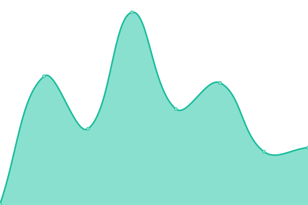

# [📈 Live Status](https://status.meermubashar.com): <!--live status--> **🟥 Complete outage**

This repository contains the open-source uptime monitor and status page for [Meer Mubashar ✪](meermubashar.com), powered by [Upptime](https://github.com/upptime/upptime).

With [Upptime](https://upptime.js.org), you can get your own unlimited and free uptime monitor and status page, powered entirely by a GitHub repository. We use [Issues](https://github.com/meermubashar/upptime/issues) as incident reports, [Actions](https://github.com/meermubashar/upptime/actions) as uptime monitors, and [Pages](https://status.meermubashar.com) for the status page.

<!--start: status pages-->
<!-- This summary is generated by Upptime (https://github.com/upptime/upptime) -->
<!-- Do not edit this manually, your changes will be overwritten -->
<!-- prettier-ignore -->
| URL | Status | History | Response Time | Uptime |
| --- | ------ | ------- | ------------- | ------ |
|  [Meer Mubashar (Homepage)](https://meermubashar.com) | 🟥 Down | [meer-mubashar-homepage.yml](https://github.com/meermubashar/upptime/commits/HEAD/history/meer-mubashar-homepage.yml) | 

 150ms
     
 | 

<a href="https://status.meermubashar.com/history/meer-mubashar-homepage">0.00%</a>
    

|  [Meer Mubashar (Server Health)](https://meermubashar.com/healthcheck.php) | 🟥 Down | [meer-mubashar-server-health.yml](https://github.com/meermubashar/upptime/commits/HEAD/history/meer-mubashar-server-health.yml) | 

 17ms
     
 | 

<a href="https://status.meermubashar.com/history/meer-mubashar-server-health">0.00%</a>
    

|  [Suii Dhaaga Clothing](https://suiidhaagaclothing.com) | 🟥 Down | [suii-dhaaga-clothing.yml](https://github.com/meermubashar/upptime/commits/HEAD/history/suii-dhaaga-clothing.yml) | 

 172ms
     
 | 

<a href="https://status.meermubashar.com/history/suii-dhaaga-clothing">0.00%</a>
    

|  [The Media Lenses](https://themedialenses.com) | 🟥 Down | [the-media-lenses.yml](https://github.com/meermubashar/upptime/commits/HEAD/history/the-media-lenses.yml) | 

 161ms
     
 | 

<a href="https://status.meermubashar.com/history/the-media-lenses">0.00%</a>
    

<!--end: status pages-->

[**Visit our status website →**](https://status.meermubashar.com)

## 📄 License

- Powered by: [Upptime](https://github.com/upptime/upptime)
- Code: [MIT](./LICENSE) © [Anand Chowdhary](https://anandchowdhary.com), supported by [Pabio](https://pabio.com)
- Data in the `./history` directory: [Open Database License](https://opendatacommons.org/licenses/odbl/1-0/)
